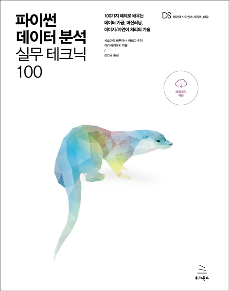

# 파이썬 데이터 분석 실무 테크닉 100
### 100가지 예제로 배우는 데이터 가공, 머신러닝, 이미지/자연어 처리의 기술

- **시모야마 테루마사, 마쯔다 유마, 미키 타카유키** 지음 | **손민규** 옮김
- ISBN: 9791158392178
- 판형: 175x235x17mm
- 26,000원 | 2020년 7월 30일 발행 | 292쪽
- [책 홈페이지](https://wikibook.co.kr/pyda100/)
- [도서 미리보기](http://www.yes24.com/Product/Viewer/Preview/91302724)
- [도서 관련 문의](https://wikibook.co.kr/support/contact/)

---

《파이썬 데이터 분석 실무 테크닉 100》은 실제 비즈니스 현장에서 마주칠 수 있는 100개의 예제를 풀면서 현장 분위기를 몸에 익히고 현장에 맞게 기술을 응용하는 힘을 기를 수 있게 설계한 문제집입니다.

이 책에 실린 100개의 테크닉을 익힌다고 해서 바로 현장에 적용할 수 있는 것은 아니지만, 현장 감각을 몸에 익힘으로써 비즈니스 현장에 자연스럽게 투입되기 위한 힘을 기를 수 있습니다. 인터넷이나 입문서로 데이터 분석과 머신러닝을 배우고 나서 ‘붓꽃 분류보다 도움이 되는 데이터 분석을 하고 싶다’, ‘비즈니스 현장에서 이런 기술이 어떻게 응용되는지 알고 싶다’라고 생각하는 사람에게는 이 책이 분명 도움이 될 것입니다.

---
 
 ## 구입처
 
 - [예스24](http://www.yes24.com/Product/Goods/91302724)
 - [교보문고](http://www.kyobobook.co.kr/product/detailViewKor.laf?barcode=9791158392178)
 - [인터파크](http://book.interpark.com/product/BookDisplay.do?_method=detail&sc.prdNo=335118869)
 - [알라딘](https://www.aladin.co.kr/shop/wproduct.aspx?ItemId=246893418)